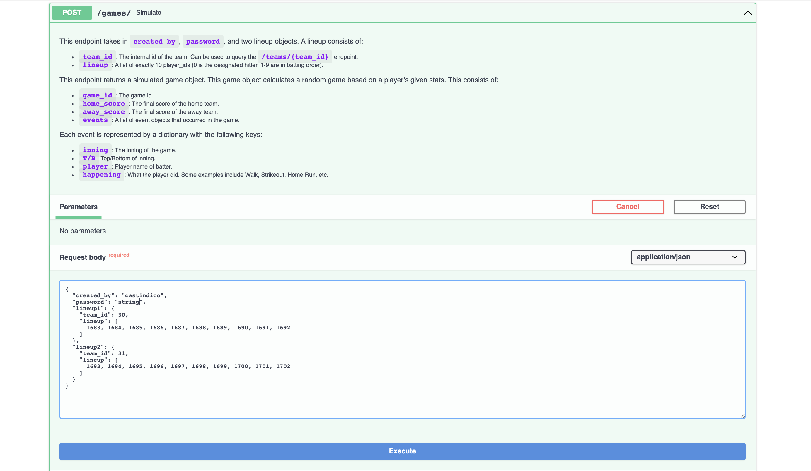

<h1 align="center">
  <a href="https://tarrevizsla.tumblr.com/post/670792162162671616/things-renew-themselves-irresistible-revolution">
    <!-- Please provide path to your logo here -->
    
  </a>
</h1>

  Basically Accurate Simulator Endpoints -- for Ball
   
  <a href="https://github.com/franktucci/basically-accurate-simulator-endpoints-for-ball/tree/staging/images"><strong>Explore the screenshots »</strong></a>
   
   
  <a href="https://github.com/franktucci/basically-accurate-simulator-endpoints-for-ball/issues/new?assignees=&labels=bug&template=01_BUG_REPORT.md&title=bug%3A+">Report a Bug</a>
  ·
  <a href="https://github.com/franktucci/basically-accurate-simulator-endpoints-for-ball/issues/new?assignees=&labels=enhancement&template=02_FEATURE_REQUEST.md&title=feat%3A+">Request a Feature</a>
  ·
  <a href="https://github.com/franktucci/basically-accurate-simulator-endpoints-for-ball/issues/new?assignees=&labels=question&template=04_SUPPORT_QUESTION.md&title=support%3A+">Ask a Question</a>

 

Table of Contents

- [About](#about)
  - [Built With](#built-with)
- [Getting Started](#getting-started)
  - [Prerequisites](#prerequisites)
  - [Installation](#installation)
- [Usage](#usage)
- [Roadmap](#roadmap)
- [Support](#support)
- [Project assistance](#project-assistance)
- [Contributing](#contributing)
- [Authors & contributors](#authors--contributors)
- [Security](#security)
- [License](#license)
- [Acknowledgements](#acknowledgements)

---

## About

<table><tr><td>

> Battle against friends, create teams with different mlb players (or make your own!). Basically Accurate Simulator Endpoints -- for Ball
> offers rich and complex functionality for simulating fake baseball games. Simply register your user, and choose from
> hundreds of players with real life players with stats from the 2022 season, or create your own. See how your players stack up against your friends
> to play.

Screenshots

 

> Simply go to /docs/ to try it out!

|                           Create a Team                           |                          Simulate a Game                           |                   Check your Player's Standings                    |
|:-----------------------------------------------------------------:|:------------------------------------------------------------------:|:------------------------------------------------------------------:|
|  |  |  |

</td></tr></table>

### Built With

> * PostgreSQL database interfaced with sqlalchemy querybuilder in python
> * FastAPI web framework

## Getting Started

### Prerequisites
basically-accurate-simulator-endpoints-for-ball
> The API requires a stable internet connection and an interest or curiosity in baseball!

### Installation

> No need to install anything! Simply make an account and you're all set.

## Usage

GET /players/{player_id}

    This endpoint returns a player's stats.
    * `player_id`: The internal id of the player. Can be used to query the
      `/players/{player_id}` endpoint.
    * `player_name`: The name of the player.
    * `created_by`: The user who created the team. Is null for real-life teams.
    * `team_id`: The internal id of the team the player plays on. Can be used to query the
      `/teams/{team_id}` endpoint.
    * `positions`: A string representation of the positions a character can play.
    * `at_bat`: The number of times a player has been up to bat, total.
    * `singles`: The number of times the ball is hit and the batter gets to first base.
    * `doubles`: The number of times the ball is hit and grants the batter 2 bases.
    * `triples`: The number of times the ball is hit and grants the batter 3 bases.
    * `home_runs`: The number of times the batter hits a home run.
    * `walks`: The number of times the batter walks. This grants the batter one base.
    * `strike_outs`: The number of times the batter strikes out.
    * `hit_by_pitch`: The number of times the batter is hit by the pitch. This grants the batter one base.
    * `sacrifice_flies`: The number of times the batter hits a fly ball that is caught out with less than two outs and, in the process, assists in a run.
    * `stolen_bases`: The number of times a runner successfully has stolen a base.
    * `caught_stealing`: The number of times a runner gets out in the process of stealing a base.
    * `on_base_percent`: Calculated (Hit + Ball + HBP) / (At-Bat + Walk + HBP + Sacrifice-Fly)
    * `batting_average`: Calculated Hit / At-bat

POST /players/

    This endpoint takes in a `first_name`, `last_name`, `team_id`, `created_by`,
    `password`, and `position`.

    `position` can be one of the following options: 1B, 2B, SS, 3B, IF, OF, P, C, DH

    The endpoint returns the id of the resulting player that was created.

GET /players/

    This endpoint returns a list of players. For each player it returns:

    * `player_id`: The internal id of the player. Can be used to query the
      `/players/{player_id}` endpoint.
    * `player_name`: The name of the player.
    * `team_name`: The team name of the player.
    * `created_by`: The user who created the team. Is null for real-life teams.
    * `positions`: A string representing the positions the player can play.
    * `at_bats`: The number of times a player has been up to bat.
    * `on_base_percent`: Calculated (Hit + Ball + HBP) / (At-Bat + Walk + HBP + Sacrifice-Fly)
    * `batting_average`: Calculated Hit / At-bat

    You can filter for players whose name starts with a string by using the
    `name`, `team`, `created` query parameters.

    You can filter the results by using the `show` query parameter:
    * `real` - Real life players only.
    * `fake` - Fake players only.
    * `both` - Both real and fake players.

    You can sort the results by using the `sort` query parameter:
    * `id` - Sort by player_id.
    * `name` - Sort by first name alphabetically.

DELETE /players/{player_id}

    This endpoint deletes a player. It takes in a `password`.

    The endpoint returns the id of the resulting player that was deleted.

GET /teams/{team_id}

    This endpoint returns a team's information. It returns:
    * `team_id`: The internal id of the team. Can be used to query the
      `/teams/{team_id}` endpoint.
    * `created_by`: The user who created the team. Is null for real-life teams.
    * `team_city`: The city the team is located in. Can be null for virtual teams.
    * `team_name`: The name of the team.
    * `players`: A list of the team's player_id's. Can be used to query the
      `/players/{player_id}` endpoint.

POST /teams/{team_id}

    This endpoint adds a team. It takes in a `team_name`, `team_city`, `created_by`, and `password`.

    The endpoint returns the id of the resulting team that was created.

GET /teams/

    This endpoint returns a list of teams. For each team it returns:

    * `team_id`: The internal id of the team. Can be used to query the /teams/{team_id} endpoint.
    * `created_by`: The user who created the team. Is null for real-life teams.
    * `team_city`: The city the team is located in. Can be null for fictional teams.
    * `team_name`: The name of the team.
    * You can filter for teams whose name starts with a string by using the name or created by by using the
    `name` and/or `created` query parameters.

    You can filter the results by using the `show` query parameter:
    * `real` - Real life players only.
    * `fake` - Fake players only.
    * `both` - Both real and fake players.

    You can sort the results by using the `sort` query parameter:
    * `id` - Sort by team_id.
    * `name` - Sort by team name alphabetically.

DELETE /teams/{team_id}

    This endpoint deletes a team. It takes in a `password`.

    The endpoint returns the id of the resulting team that was deleted.

GET /games/{game_id}

    This endpoint returns a game. It returns:
    * `game_id`: The internal id of the team. Can be used to query the
      `/games/{game_id}` endpoint.
    * `created_by`: The user who created the team. Is null for real-life games.
    * `home_team_id`: The id of the home team. Can be used to query the `/teams/{team_id}` endpoint.
    * `away_team_id`: The id of the away team. Can be used to query the `/teams/{team_id}` endpoint.
    * `home_score`: The score of the home team.
    * `away_score`: The score of the away team.

POST /games/

    This endpoint takes in `created by`, `password`, and two lineup objects. A lineup consists of:
    * `team_id`: The internal id of the team. Can be used to query the `/teams/{team_id}` endpoint.
    * `lineup`: A list of exactly 10 player_ids (0 is the designated hitter, 1-9 are in batting order).

    This endpoint returns a simulated game object. This game object calculates a random game based on a
    player’s given stats. This consists of:
    * `game_id`: The game id.
    * `home_score`: The final score of the home team.
    * `away_score`: The final score of the away team.
    * `events`: A list of event objects that occurred in the game.

    Each event is represented by a dictionary with the following keys:
    * `inning`: The inning of the game.
    * `T/B` Top/Bottom of inning.
    * `player`: Player name of batter.
    * `happening`: What the player did. Some examples include Walk, Strikeout, Home Run, etc.

POST /users/

    This endpoint takes in a `username` and `password`. The player is represented
    by a username and a password that is validated for user-level operations (Please don't input, like,
    your actual bank password here)

    This function maintains unique usernames.

    The endpoint returns the username of the resulting user that was created.

DELETE /users/{username}

    This endpoint deletes a user. It takes in a `password`.

    The endpoint returns the id of the resulting user that was deleted.

## Roadmap

See the [open issues](https://github.com/franktucci/basically-accurate-simulator-endpoints-for-ball/issues) for a list of proposed features (and known issues).

- [Top Feature Requests](https://github.com/franktucci/basically-accurate-simulator-endpoints-for-ball/issues?q=label%3Aenhancement+is%3Aopen+sort%3Areactions-%2B1-desc) (Add your votes using the 👍 reaction)
- [Top Bugs](https://github.com/franktucci/basically-accurate-simulator-endpoints-for-ball/issues?q=is%3Aissue+is%3Aopen+label%3Abug+sort%3Areactions-%2B1-desc) (Add your votes using the 👍 reaction)
- [Newest Bugs](https://github.com/franktucci/basically-accurate-simulator-endpoints-for-ball/issues?q=is%3Aopen+is%3Aissue+label%3Abug)

## Support

> Contact us at rcaler@calpoly.edu, ftucci@calpoly.edu, or stomerho@calpoly.edu

Reach out to the maintainer at one of the following places:

- [GitHub issues](https://github.com/franktucci/basically-accurate-simulator-endpoints-for-ball/issues/new?assignees=&labels=question&template=04_SUPPORT_QUESTION.md&title=support%3A+)
- Contact options listed on [this GitHub profile](https://github.com/franktucci)

## Project assistance

If you want to say **thank you** or/and support active development of Basically Accurate Simulator Endpoints -- for Ball:

- Add a [GitHub Star](https://github.com/franktucci/basically-accurate-simulator-endpoints-for-ball) to the project.
- Tweet about the Basically Accurate Simulator Endpoints -- for Ball.
- Write interesting articles about the project on [Dev.to](https://dev.to/), [Medium](https://medium.com/) or your personal blog.

Together, we can make Basically Accurate Simulator Endpoints -- for Ball **better**!

## Contributing

First off, thanks for taking the time to contribute! Contributions are what make the open-source community such an amazing place to learn, inspire, and create. Any contributions you make will benefit everybody else and are **greatly appreciated**.

Please read [our contribution guidelines](CONTRIBUTING.md), and thank you for being involved!

## Authors & contributors

The original setup of this repository is by [Frank Tucci](https://github.com/franktucci), [Randall Caler](https://github.com/franktucci), and [Sean Tomer](https://github.com/smtomer).

For a full list of all authors and contributors, see [the contributors page](https://github.com/franktucci/basically-accurate-simulator-endpoints-for-ball/contributors).

## Security

Basically Accurate Simulator Endpoints -- for Ball follows good practices of security, but 100% security cannot be assured.
Basically Accurate Simulator Endpoints -- for Ball is provided **"as is"** without any **warranty**. Use at your own risk.

_For more information and to report security issues, please refer to our [security documentation](SECURITY.md)._

## License

This project is licensed under the **MIT license**.

See [LICENSE](LICENSE) for more information.

## Acknowledgements

> Data gathered from [retrosheet](https://www.retrosheet.org)
